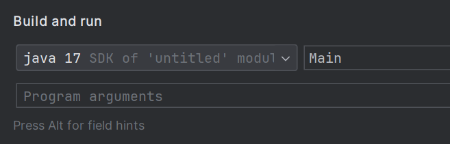

# Java互助课堂（周一
# 1.Introduction

徐延楷 a.k.a. Froster  
20级的老东西

本来想叫它Programming 101的，还是跟互助课堂吧

周一和周五的风格大概也许差别挺大

---

# 扫左边的签到，右边的加互助课堂群
（来这的不会有人没加互助课堂群吧orz

<div grid="~ cols-2 gap-4">
<div>

</div>
<div>

</div>
</div>
---

# 课前声明
先水一下时间

我个人是第一次讲课，肯定不如讲了好多年的教授，所以大课还是要去的

课件是基于自己的理解做的，很可能充满知识的诅咒。如果没听懂或者觉得我讲错了，直接提问。

我就是个大四的老东西，水平很可能不如你们，和教授说话还犯社恐，所以放心讨论问题

前几届的互助课堂群的讨论和交流氛围挺融洽的，课下（或者课上）有问题欢迎往那里面发
- 但是别在里面发癫
- **更别在里面发大段代码，以及搞什么抄袭代写的，被抓到非常可能直接挂科**

---

# 为什么要写代码？

+ 计算
  - 求解 $f(x) = ax + b$
  - 求解 $f(x) = 1145f(x^{14}) + 1919x - \frac{810}{x}$
  - 求解一张图像上有没有人脸
  - 求解从宝安机场到南科大怎么走最近
  - 现有一张excel表，过滤掉里面所有姓名不为张三的人
+ 控制
  - 让一盏led灯亮起来
  - 让一盏led灯每秒闪烁一次
  - 让一盏led灯以1, 1, 4, 5, 1, 4秒的间隔循环闪烁
  - 现有一辆往前跑的小车，如果车前面有障碍物则右转继续跑
  - 让一个游戏人物的模型在按下鼠标左键时做铁山靠

---

# 功能的组合
如何实现上面的需求？

<!--要实现上面的功能，需要知道计算机都能干啥-->

<div grid="~ cols-2 gap-4">
<div>

+ 求解 $f(x) = 114x + 514$
  - 输入 $x$ （从设备，比如键盘，输入）
  - 计算乘法：$114 \times x$，**保存结果**，记作 $a$
  - 计算加法：$514 + a$，保存结果，记作 $b$
  - 输出 $b$ （显示到某个地方）

<br />

***
做数学题的时候在草稿纸上会这么写：

$$
  114 * 10 = 1140 \\
  1140 + 514 = 1654
$$

</div>
<div>

``` java
void f() {
    // print(114 * readNumber() + 514);
    int x = readNumber();
    int a = 114 * x;
    int b = a + 514;
    print(b);
}

```
</div>
</div>
算数的时候有点像工厂里的流水线—— 一个东西进来，先在前面的机械被加工。然后在后面被加工，以此类推...

代码的每一行就像是加工机械，“东西”是数据，你的一堆机械把数据加工成你想要的样子。

---

# 功能的组合

<div grid="~ cols-2 gap-4">
<div>

+ 有一辆小车，让它持续前进，如果车前面有障碍物则右转再继续前进
  - 控制小车的轮子往前滚
  - 读取传感器数据
  - 如果：
    + 传感器数据显示有障碍：
      - 控制轮子停下
      - 右转
    + 传感器数据显示没有障碍：
      - 什么都不做
  - **回到第一步**

</div>
<div>

``` java
void control() {
    while (active) {
        moveForward();
        SensorData data = readSensorData();
        if (hasObstacle(data)) {
            stopMoving();
            turnRight();
        } else {
            // do nothing
        }
    }
}
```
</div>
</div>

---

# 功能的组合
编程的本质其一

rt，组合已有的功能去完成你的需求。

最类似的可能是化学大题里写有机合成路线。

对已有功能的记忆+熟悉常见的组合模式。

-----

# 功能从哪来？
layers of abstraction

<!--有点像公理-->
计算机（在这门课里是jvm）提供：加减乘除，判断，跳转，存储......

编程语言（在这门课里是jre）和第三方库提供：乘方，对数，求导，读写文件，访问网络，控制外设......

编程的绝大部分工作是在发明自己的功能（我们把这个叫函数/方法）。

鲁迅没有说过：编程就是把问题不断分解为小问题，小问题分解为更小的问题，最终分解到已有的功能上去。

``` java
void solve() {
    boolean flag = isLeapYear();
    if (flag) {
        print();
    }
}

boolean isLeapYear() {
    ...
}
```

-----

# 一些编程的本质
我自己说的，仅供参考

上一页最后那句话里的“问题”和“功能”是一开始所讲的——针对**数据**的计算和**状态**的控制。

把输入的数据经过你定义的过程处理成你想要的数据。比如说，计算一系列数的最大值，或者把字符串里的单词全部转为大写。

或者，根据输入的数据，经过你定义的过程去做一些事情。比如说控制机器人，从网上下载指定文件。

编程会让你学会如何定义过程，也就是教计算机做事。但是解决问题的时候一定要对问题——即数据或者要做的事情，有一个清晰的认识。

↑意思是不要大脑空空的开始瞎写，期待自己能像猴子打字机那样敲出莎士比亚全集。

---

# 如何学习
a.k.a. 我们学编程的时候是在学什么？

怎么学会教计算机做事呢？

写代码的能力 = 描述问题 + 知道问题如何分解 + 知道已有的功能 + 知道如何组合已有的功能

~~非常不负责的~~拿去年的lab题目举个例子：

给定$p, q, a_0...a_n$，求解$\int_{q}^{p} a_0 + a_1x + a_2x^2 + ... + a_nx^n$。

现在的问题：java里没有算积分的函数。

所以想到，如果是在数学卷子上看到，步骤应该是这样：

$\int a_0 + a_1x + a_2x^2 + ... + a_nx^n = a_0x + \frac{a_1x^2}{2} + ... + C$，然后代数，做减法。

---

# 如何学习
a.k.a. 我们学编程的时候是在学什么？

现在的问题是，如何计算$a_0x + \frac{a_1x^2}{2} + ... + C$？（问题）

要计算上面的式子，需要：让程序知道$n, a_0...a_n$，计算$x^i, a(x^i), a_0x+\frac{a1x^i}{2}+...$，即算乘方，算加法乘法除法，算n个数的加法，再把结果打印出来。（小问题）

你们应该已经知道怎么输入输出了和算加减乘除了。（已有的功能）

循环结构应该也学过，用这个让计算机把算加法这件事干n遍。（还是已有的功能）

对于乘方，我们知道乘方是做n次乘法，所以可以像上面算n个数的加法那样自己写一个乘方的函数（功能），也可以**进行一个搜索引擎的使用**，发现有一个函数 `Math.pow()`是算乘方的，直接利用前人写好的东西。

搜索引擎是必须要常用的。不像高中那些数学公式，编程里前人写好的东西太多了，没有人全记得住。大伙都是有需要的时候现查的。

---

# 如何学习
a.k.a. 我们学编程的时候是在学什么？

最后动用一下你的逻辑思维把这些东西全都组合起来（这一块就是 知道一些范式，然后多练！）：

+ 读入所有的a，以及p, q
+ 记那个公式是g(x)，问题的答案是g(p) - g(q)
  - g(x)是n个数的求和，要求和必须先知道数等于什么。用循环结构依次计算累加
    + 第i个数是$\frac{a_ix^i}{i+1}$，计算之
    + 把第i个数和前面的累加结果加起来
+ 输出结果

``` java
  // 伪代码
  int a = ..., p = ..., q = ... // a = [1, 2, ...], p = 114, q = 514 读入环节
  // g(p), g(q)
  int sumP = 0, sumQ = 0;
  for (int i = 0; i < a.length; i++) { // 循环，你们现在只需要知道这个里面的两行执行n次，第几次由i表示
    sumP = sumP + (a[i] * math.pow(p, i)) / (i + 1);
    sumQ = sumQ + (a[i] * math.pow(q, i)) / (i + 1);
  }
  print(sumP - sumQ) // 输出
```

---

# 其他问题
开始碎碎念

First of all.....
### 我不是寄系/电子系的，可以混过去吗？
可以。但是编程以后是你吃饭的家伙之一。你可以把高等数学忘光光，但进了实验室多少还得写点代码。

---

# 如何让自己的代码看得懂
良好的代码风格
``` java
for(int i=0;i<a;i++){if(i< 3)
{
  x +=1;y+= z;
}}

if (a&&b&&c&&d&&e&&f) //bad
if (a && b && c && d && e && f)
```
``` java
for (int i = 0; i < totalLen; i++) {
    if (i < 3) {
        descOfX += 1;
        descOfY += descOfZ;
    }
}
```

显然上面的一坨难以阅读...

经常使用 `Ctrl + Alt + L`格式化你的代码

使用有意义的变量名和方法名（project时会再讲，lab就还好）

写注释

---

# 我的代码在本地为什么报错了？
大佬这有一堆红字我...诶我看得懂

首先，虽然**报错信息**它是英文的，而且里面估计有114514个你没见过的词，但是它设计出来

## 是为了给人看懂的！！！！！！！！

main -> mian

列几个常见报错：
- 编译错误：少分号/变量名打错/类名或关键字打错/大括号错了
- 运行时错误：多了去了
  + `ArithmeticException: / by zero`： "/ by zero"，as described
  + `ArrayIndexOutOfBoundsException: Index 1 out of bounds for length 0`：数组越界
  + `NullPointerException: Cannot invoke "..." because ... is null`：空指针，下节课讲

---

# 本地跑代码没问题，为什么oj报错了？
很可惜，oj没错。

oj的工作机制：准备好多种不同的输入数据，检查你程序的输出对不对

对于一组数据，如果你的输出和数据相符，那这个数据就通过了（<span style="color: lime">绿色Accepted</span>）

题目给你的样例一般是较简单的一组，里面的数据相对更为复杂，更能检测你代码的正确性

错了就自己造样例或者通读代码好好检查吧QAQ

OJ的各种错误类型：
- Compile Error(CE)：编译错误。检查：主类应该是Main，开头应该没有Package，程序没有语法错误
- Runtime Error(RE): 程序报错了。一般来说是数组越界，或者你有个数除以0了。
- Timeout(TLE)：程序超时了。java作业不考察程序的高效性，所以一般是你的程序里有死循环。

```java
for (int i = n; i >= 0; i++)

```

---

# 怎么解决错误？
大佬不是你的网页浏览器

错误的处理方法：报错->大佬这里怎么改->大佬这里怎么改->大佬这里怎么改->大佬这里怎么改->... 

然后不进脑子，下次还错，然后**反复**错一些简单的问题，折磨自己也折磨sa最后成绩也不好看。

正确的处理方法：报错->**为什么错？**
- 报的这个错没见过->它是什么？->学会->以后不犯错，或者学会解决相似问题的方法
- 没报错，但是oj说你错了/你发现结果不对：利用debug工具或者打印查看中间结果->找到逻辑漏洞->结束

---

# 怎么问问题？
什么问题合适？

虽然自主解决问题的能力必须有，但是提问也是必须的！SA，TA和教授们很喜欢你们提问！

~~SA不喜欢也得喜欢，人每个月是领工资的，不用担心麻烦人~~

提问的智慧：https://github.com/tvvocold/How-To-Ask-Questions-The-Smart-Way

建议所有人回去通读一遍。我们和sa作为助教肯定不会像文章里那么的苛刻，可以按这个省流版本来：
- 以下所有的都是态度问题。不要把其他人当成保姆:(
- 问之前先用搜索引擎查一下，SA不是你的浏览器（推荐使用Google，其次bing，百度狗都不用）
- 问之前简单翻翻聊天记录。
- 问之前先根据你的代码和报错自己解决一下问题。如果没有成功，问的时候附带上你的解决方法。
- 问的时候提供报错和代码。如果无法提供代码（怕查重），说思路，或者小窗问sa。不提供这些内容的问题就像“我今年高考数学倒数第二道大题错了，为什么？”
- 问的时候带上你的脑子。你得到的会是思路和解决方法，而非具体的代码。
- 问之前方便的话自己试一下。形如“a这样用会不会报错”这种问题，很多时候是自己敲进去跑一下就知道的事

---

# 老师没教怎么办？
啥都不会，一看就是上大学上的 ~~（不是玩原神玩的）~~

## **自己学。**

大学，至少是计算机课程，没有超纲。

别人写作业写仨小时，你用老师没教的牛逼方法三分钟把作业秒了，那你牛逼，活该多玩三小时。

（老师教的你也得会，不过编程会了后面的前面的也应该会了。）

而且，知识太多了，教授的课程时间有限，不可能什么都讲。

讲计算机的书似乎没有其他学科那么成体系，而且越到后面越少（虽然足够cover计算机系课程了），到最后你只能去读官方文档，甚至原代码和论文。

b站和ytb上不少很好的课，大伙可以跟着学学。

---

# 如何使用搜索引擎
远离csdn

搜索引擎排名：谷歌大于bing，除非你在查很基础很基础的东西，否则不要百度。

问搜索引擎的方法：
- 问ArrayList是什么：java arraylist
- 问java怎么算乘方：java 乘方 / java calculate power

少点转折和语气词，只用关键词

推荐使用谷歌，或者bing的国际版，然后用英文关键词搜索。这样你能搜到**StackOverflow**的答案，能解决99%的问题。

中文社区真的不行，少看csdn。StackOverflow上的回答一般会仔细分析问题的原理，给出多种解法，还有很多人的讨论。csdn上一般只贴莫名其妙的代码，还不一定好使。（对于java这门课来说...勉强够用）

btw，科学上网几乎是必备的。你需要流畅的访问Google，StackOverflow，Github，Chatgpt，各种乱七八糟的官网，以及使用各种包管理器。

---

# 如何看待LLM？
天坑

个人不建议在第一门编程课上使用ChatGPT。一定不要用它写代码，也很不建议问它问题。
- 写代码是需要大量练习的。用一学期chatgpt等于高中抄一学期数学作业，到头啥也做不出来。
- 使用搜索引擎和向别人提问是很有用的技能。有的东西chatgpt没法告诉你，前两者可以，但是需要一点点练习。
- 它不总是对。可能你写代码也就半小时，但是问chatgpt五分钟，debug两小时。
- 而且你现在没有判断他对不对的能力。
- LLM没有设计代码的能力。它可以很好的写一个函数，但遇到几千行规模的代码无能为力。
- 如果十个人同时用了chatgpt写一份作业，它给出的代码估计差不多。被查重挂科了会很难看。

这玩意有点像搜题软件。不过软件能保持正确率，它不能。而且用过搜题软件的大伙应该都明白，需要自制力...

---

# 还是得讲点知识。。。
<div />
High level的东西讲完了，总得讲点lecture上讲的！

----- 

# 编译
背诵内容

电脑本身没有执行`int a = b + c`的功能，只有执行`add r0, r1, r2`的功能

后面那是汇编语言，又臭又长又容易出错

所以得把你写的简单的人类能懂的java编译(compile)过去，干这活的叫编译器(compiler)。

编译器一次编译一整个程序，不太灵活。所以就有了解释器，一行一行编译。

-----

# JRE and JVM and JDK
背诵内容

JVM：一个**虚拟机(Virtual Machine)**。安卓模拟器也是个“虚拟机”

为什么要jvm：
- 现在有一个中国人和一个美国人，你想让他们算1+1
- 和中国人你得说“一加一”，和美国人你得说“one plus one”
- 那如果有一个印度人你还得说印度话...
- jvm起一个翻译软件的作用。你只需要写下1+1，交给jvm翻译一下，你就可以指挥全世界的人算1+1了

JRE：JVM + 一堆库。你有了电脑还要在上面装各种软件，JVM是电脑，JRE是电脑+软件

JDK：JRE + 开发工具。

java为啥又编译又解释：把你说的1+1**编译**成jvm能看懂的形式（字节码byte code），再根据平台**解释**成机器码

----- 

# lecture课件里的第一个程序
`java test a b c`

``` java
public class Welcome {
  public static void main(String[] args) {
    System.out.println(args[1]); // a
    System.out.println(args[2]); // b
  }
}
```



- `public, class, static`：后面再讲，在你们写多个文件的程序之前抄上去就好
- `public static void main(String[] args)`：主方法。计算机会从这个方法开始执行程序。
- `System.out.println("Welcome to Java Programming!");`语句。
- `//, /* */`：注释。给人看的。后面会讲怎么写一个自己过了一周还能看得懂的程序。
- `{}`：block，或者我更喜欢叫作用域。后面会讲。

-----

# 用命令行跑java程序
真有人记得住这个？

`javac test.java`编译

`java test`运行

考试顶多一道选择。记得带c的是编译(**C**ompile)，不带的就是运行。

-----

# 输入输出
你们学了class才会知道前面一大坨是干什么的...

## 输出
- `System.out.print(String s)`：把s打印出来
- `System.out.println(String s)`：把s打印出来再换个行。ln -> line
- `System.out.printf(String format, ...)`：这个可以格式化输出，非常的牛

``` java
int a; float b; String c;
System.out.printf("output integer: %d, float: %f, str: %s", a, b, c);
```

输出的时候会把abc从前往后填进`%d, %f, %s`里。百分号后面跟一个字母代表占位符。

`%d`是`int`类型，`%f`是`float`，`%s`是字符串。常用的就这仨，如果要输出`long`，或者要设定小数位数，整数前面补0什么的，自己查

类型错了会报`java.util.IllegalFormatConversionException: d != java.lang.String`

-----

# 输入输出
你们学了class才会知道前面一大坨是干什么的...

## 输入
``` java
// 程序的最前面：
import java.util.Scanner;

// ...

Scanner scanner = new Scanner(System.in); 
String s = scanner.next();
String strs[] = s.split(' ');

int i = scanner.nextInt();
T t = Scanner.nextT(); // T for any
```

没啥好说的，复制粘贴。你想要什么类型就next什么东西一下。

Scanner以空格或者换行作为一次读入的结束。

有一个`scanner.nextLine();`。印象里oj用这个会有bug，少用。

-----
# 转义
\

java的字符串在代码里只能写在一行上。所以我们得有个法表示换行...`\n`。

记得`\n`是换行，`\\`是"\"，`\"`是'"'就行。

# 预告

- 类型系统，变量，内存
- 有时间就讲点控制语句
