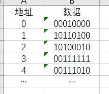
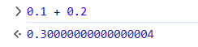
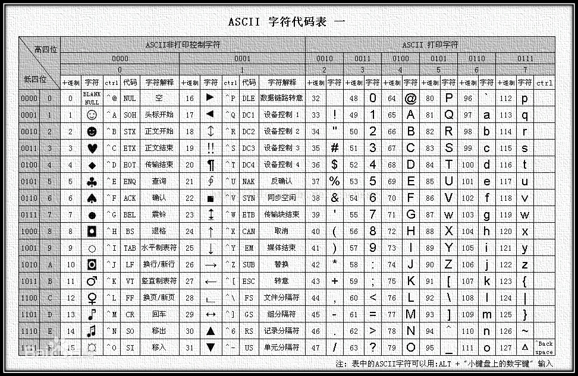

# Java互助课堂（周一
# 2. 基本数据类型和基本运算

徐延楷 a.k.a. Froster  
20级的老东西

课件是周日和周一做的，苯人是周一社恐死的

周一和周五的风格大概也许差别挺大

-----
# 变量是什么？
本来打算这次课只讲这个，但是你们好像还没学到后面的，就先简单说说

**装数据的“容器”**

在口算不好的小学生计算$114 * 10 + 514$时，会在纸上写下：
$$
  114 * 10 = 1140 \\
  1140 + 514 = 1654
$$

写这么细的原因：脑容量不够了，得记录**中间结果**

变量就是干这事的，只不过我们会给每个中间结果一个名字，方便之后用。它更像物理题：

*已知$x_0 =$ ..., $v_0 =$ ..., ...

*由xxx得，*$x_1 = v_0 + at = 114m$*。所以，*$x' = x_0 + x_1 = 514m$。


-----
# 为什么有数据类型？
脑容量还是不够

计算机中的数据是存储在**内存**当中的。可以把内存抽象成一串连续的0和1：


很不幸，每存储一个0或1就需要使用一些电子元器件。电子元器件的数量不可能无限增长，所以内存的空间是有限的（也就是内存是有几个GB）

所以有了数据类型，用尽量小的空间去存储数字。

-----

# 各种数据类型
<div grid="~ cols-2 gap-4">
<div>

</div>
<div>
如果你要表示一个字符，用char

数字一般情况下都用int，除非装不下

考试的时候记得有byte和short这个东西就行

做oj题的时候记得检查一下数据范围
</div>
</div>

| 类型 | 大小 | 范围 |
| ---- | ---- | ---- |
| byte | 8 bits / 1 byte | $2^8$ or $[-128, 127]$ |
| short / char | 2 bytes | $2^{16}$ or $[-32768, 32767]$ |
| int | 4 bytes | $2^{32}$ or $[-2147483648, 2147438647]$ |
| long | 8 bytes | $2^{64}$ |

-----
# 溢出
2147483647 + 1 = -2147483648

举个栗子。`int`只能装32个bit。最高一个bit是符号位（代表正负）

如果我们把`0111....1111`（31个1）这个数再加一，会变成`1000...000`（1，然后31个0）

这时候符号位变了，剩下的全是0。由于一些奇妙的数学原因，这个数是-2147483648。

数字的溢出有点像钟表表盘。把0放在12点钟，一个类型的最大值和最小值放在6点钟，然后开转！

-----
# 浮点数
0.1 + 0.2 != 0.3？



和上面一样，我们也没法表示无限位数的小数。

| 类型 | 大小 | 每个部分的大小（不用记） |
| ---- | ---- | ---- |
| float | 4 bytes | E: 8bits，M: 23 bits |
| double | 8 bytes | E: 11bits，M: 52 bits |

浮点数实际上是：$M * 2^E$，精度损失从这来的

-----
# boolean
T / F

真 / 假

| 运算 | 含义 | “自然语言” |
| - | - | - |
| a && b | a，b均T则T，否则F（有一个F就F） | 如果a和b均成立，则... |
| a \|\| b | a，b均F则F，否则T（有一个T就T） | 如果a成立或者b成立，则... |
| !a | 把a反过来 | 如果a不成立，则... |

优先级：`!` >> `&&` > `||`

如果有多个条件判断，推荐加括号。
``` java
// if (a && b || c && !d）// bad
if ((a && b) || (c && !d))
```

-----
# boolean
它从哪来？

| 运算 | 含义 |
| - | - |
| x == y, x != y | a，b相等/不相等 |
| x > y, x >= y, <, <= | 懒得打字，一看就知道 |

这些对**基本类型**的运算的结果是boolean。

`==`和`!=`对非基本类型（比如`String`和数组）也能用。这个**不是**判断变量的值是否相等。具体下节课讲。

如果要判断这些东西是否相等：
``` java
String s1, s2;
if (s1.equals(s2)) { /* ... */ }
int[] a1, a2;
if (Arrays.equals(a1, a2)) { /* ... */ }
```

-----
# char
字符类型

16位unicode编码的字符。

编码：用一个数和其他的某个东西（比如字符）唯一对应。这样就可以用数表示别的东西了！



-----
# char
字符类型

刚才有提到char是数字...

数字是可以加减乘除的。虽然我们不用乘除，但是对char的加减有一些常用场景：

``` java
int x = 1;
char a = '0' + x; // 把0-9数字转换成对应字符
char b = 'a' + x; // 第x个小写英文字母，从0开始
char c = 'A' + x; // 第x个大写英文字母，从0开始
```

``` java
String s = scanner.next();
char input = s.charAt(0); // 输入的第一个字符
int a = input - '0'; // 把0-9字符转换成对应数字
int b = x - 'a'; // 第x个小写英文字母，从0开始
int c = x - 'A'; // 第x个大写英文字母，从0开始
```

-----
# 为什么有了char还要有short？
类型系统的一点作用

因为char是字符，short是数。

当我们看到一个变量的时候，它的类型会给我们一些额外的信息，比如：
- 它里面存储什么数据？
- 它在这里是被用来干什么的？
- 它能支持什么操作？

后面学class的时候会再提。听lecture的时候记得上面这句话。

-----
# 变量声明和赋值

<div grid="~ cols-2 gap-4">
<div>

当java执行`int a = 2`时：
- 给a分配一个地址（比如0）
- 把2写入这个地址。由于int是4个bytes：
  + 地址0 1 2 3的数据分别变为2 0 0 0
- 之后使用a时，从地址0开始的4bytes拿出数据，为2

当java执行`a = 2`时：
- 找到a被分配的地址（比如0）
- 把2写入这个地址。由于int是4个bytes：
  + 地址0 1 2 3的数据分别变为2 0 0 0

当java执行`int a = 2`时：
- 给a分配一个地址（比如0）
</div>
<div>

</div>
</div>

-----
# 变量作用域

``` java
public static void main(String[] args) {
  int a;
  if (...) {
    // int a; // a already exists
    int b;
    a;
  }
  // b; // out of scope
}
```

一个变量只在一对大括号里有效。很简单...

注意，这里说的是变量而非变量的值。基本类型没事，引用类型...下节课，下节课

热知识：大括号可以单独存在，但没人这么写
``` java
public static void main(String[] args) {
  {
    int b;
  }
  // b; // out of scope
}
```

-----
# 算数
小学数学，大家都会

加减乘除取余数，不说了。

这里讲一下括号的问题。

大火学了那么长时间数学，肯定知道先乘除后加减。但是取余呢？没这个习惯。

所以：`int a = 1 + (5 % 3)`。

课件上还有个不太好的例子：`boolean isSame = 1+3 != 5*3;`。

不如`(1 + 3) != (5 * 3);`

总而言之，多打括号。括号除了改变优先级之外，还有让你不费脑子看清楚优先级的功能。

btw，我个人习惯运算符前后打上空格。看得更清楚。

-----
# 花里胡哨的算数
语法糖

``` java
a = a + 2;
a += 2;

a = a + 1;
a++;
++a;
```

所有运算都有`+=`的形式，代表自加/自减...

自己加一减一实在是太常用了（循环里面），所以有`++`和`--`。这两个的优先级最高...

所以会有~~弱智~~题目问你`a = a++ + ++a;`的结果是什么。自己写代码千万别这么写！！！！！！！！

拆一下就可以。变成：
``` java
b = a++;
c = ++a;
a = b + c;
```

-----
# 高中没学过的算数

| 运算 | 含义 | 例子（二进制的） |
| - | - | - |
| a & b | 按位与，对二进制的每一位与一下 | 11010 & 01101 = 01000 |
| a \| b | 按位或 | 11010 \| 01101 = 11111 |
| a ^ b | 按位异或（极不常用） | 11010 \| 01101 = 10111 | 
| ~a | 按位取反 | ~**11010** = 111...111**00101** |
<div grid="~ cols-2 gap-4">
<div>

注意`&`和`&&`（还有另一对）的区别：
- `&&`和`||`只能用于boolean类型
- `&`和`|`绝大多数情况不用于boolean类型
- `&&`和`||`有短路性质。看右边代码。
</div>
<div>
<br />

``` java
if (A() & B()) // 无论如何A()，B()都会被执行。用 | 也一样。
if (A() && B()) 
// 如果A()为false，则整个表达式已经是false了，再判断B()无意义。
// 为了节省性能，java直接不执行B()。
if (A() || B()) 
// 同样，如果A()为true，则整个表达式已经是true了。

// 如果无论如何都要执行B()，那用单个的。这种情况少。
```
</div>
</div>

-----
# 基础类型的类型提升
我小数呢？

如果是两个相同类型的变量加减乘除，结果还是那个类型的。

比如`3 / 2 = 1`。3和2都是`int`，除出来也是int。小数位就被抹掉了（不是四舍五入）。

如果不是相同类型的，那结果得是表示范围更大的类型（防止装不下）。

比如`3L + 2`，结果是`long`。`3.0f * 2`，结果是`float`。

具体上，`int` < `long` < `float` < `double`。`char`, `byte`, `short`运算的时候一律看作`int`。

-----
# 基础类型的类型转换（这一页的名词不需要记）
头秃

``` java
int a = 0;
long b = a;
```

为啥int可以赋给long？类型提升（隐式类型转换）了。

``` java
long a = 0;
int b = (int)a;
```

反过来就有问题了：long的数据太大int装不下会出问题。需要手动转换一下，来声明“多出来的数据我不要了”。

转换的方式是`(typename)`。括号把数据类型括起来写在变量前面。复杂的表达式就多来点括号，\
比如`((int)(a + b)) + c`

另一种用法是在整数上应用浮点运算：
``` java
long a = 3, b = 2;
double c1 = a / b; // c1 = 1
double c2 = (double)a / b; // c2 = 1.5
```

-----
# 数组
第一个数据结构

首先，数组是一堆同类型的“东西”而非一堆“数”。湾湾那边对Array的翻译叫“阵列”。

然后，定长，依次排列，可以按下标访问。

二维数组下节课再讲。

``` java
int[] arr = new int[x]; // 非基本类型（int是基本类型，int[]不是）的创建都得new。静态字符串（双引号那个）除外。
int[] arr1 = new int[]{ 10, 20, 30, 40, 50 };
int[] arr2 = { 10, 20, 30, 40, 50 }; // 创建 + 初始化
int[] arr3; // 你可以后面再用new给他赋值，但在赋值之前访问arr3会遇到你没见过的NullPointerException。非基本类型的默认值不是0。
arr[0]; // 取值
arr[y] = z; // 赋值

for (int i = 0; i < arr.length; i++) { // 循环
    arr[i];
}
for (int v : arr) { // foreach，是个语法糖
  // v是arr[i]，但是在这里给v赋值不会改arr的内容。下节课会细讲。
}

// arr = arr1; // 别这么做，下节课会细讲。
arr = arr1.clone();
```