# Java互助课堂（周一
# 3. 引用类型和方法

徐延楷 a.k.a. Froster  
20级的老东西

主要是引用类型，方法部分随便讲讲，ddl战神（苯人）没时间做课件了

-----
# 先讲一点其他的...比如复杂度...
悲伤的故事

上周有人跟我说有道题某种写法被卡时间了，然后我在群里说了这事，然后。。。

和沈姐姐确认了一下，直接模拟题目的过程是可以通过的。

借此稍微讲一下代码的时间复杂度。这部分内容在大二上的DSAA会细讲，这里简单介绍一下。

时间复杂度用于比较两个程序哪个更高效。假设我们要处理一个长为n的数组：

``` java
int[] arr = new int[n];
// input...
for (int i = 0; i < n; i++) {
  // no other loops here
}
```

这里只有一层循环。数组里的每一个元素都被访问了一遍。

一共有n个元素被访问，所以，这个程序的时间复杂度为$O(n)$。

计算时间复杂度的时候是忽略常数的。如果每个元素被访问了a遍（总共an次访问），且a为常数（不由输入所改变），那复杂度还是$O(n)$。一个例子：上面的循环复制粘贴十遍。

-----
# 还是复杂度...
不想听的可以不听，这个也不考

如果有两层循环：
``` java
int[] arr = new int[n];
// input...
for (int i = 0; i < n; i++) {
  for (int j = 0; j < n; j++) {
    // no other loops here
  }
}
```
一共有$n^2$个元素被访问，所以，这个程序的时间复杂度为$O(n^2)$。

$O()$里面的东西越大，程序花的时间越长。这个程序比上一个程序慢n倍，在n很大的情况下，容易超时。

-----
# 还是复杂度......
不想听的可以不听，这个也不考

``` java
for (int i = 0; i < n; i++) {
  for (int j = 0; j < n; j++) {
  }
}
for (int i = 0; i < n; i++) {
}
```
这个是$n^2 + n$次访问，，这个程序的时间复杂度为$O(n^2)$。

为啥捏？

首先，n越大，$n^2 + n$的增长越由$n^2$而非$n$决定。

想象我们的n趋近于无穷大，这时候$n$相比于$n^2$忽略不计，就不管他了。

-----
# 还是复杂度......
不想听的可以不听，这个也不考

``` java
int[] arr = new int[n];
// input...
for (int i = 0; i < n; i++) {
  for (int j = 1; j < n; j *= 2) {
    // no other loops here
  }
}
```
这个是$O(n\log{n})$。里面的循环执行$\log{n}$次。lab2第二题，那个求素数的，按题面模拟是这个复杂度。

知道这个有啥用呢？

下次超时的时候，如果你程序没死循环，那可以去问问出题的助教“这个题的时间复杂度是多少”。

如果他说的多项式比你的程序大，你可以检查一下你的程序有没有不必要的循环。

如果没有，并且你完全按照题目模拟，那是他不当人。你可以狠狠地argue了！

~~不过之后应该不会再出现这种情况了。沈姐姐人还是很好的~~

-----
# 引用类型
正题，希望你们带了自己的脑子来

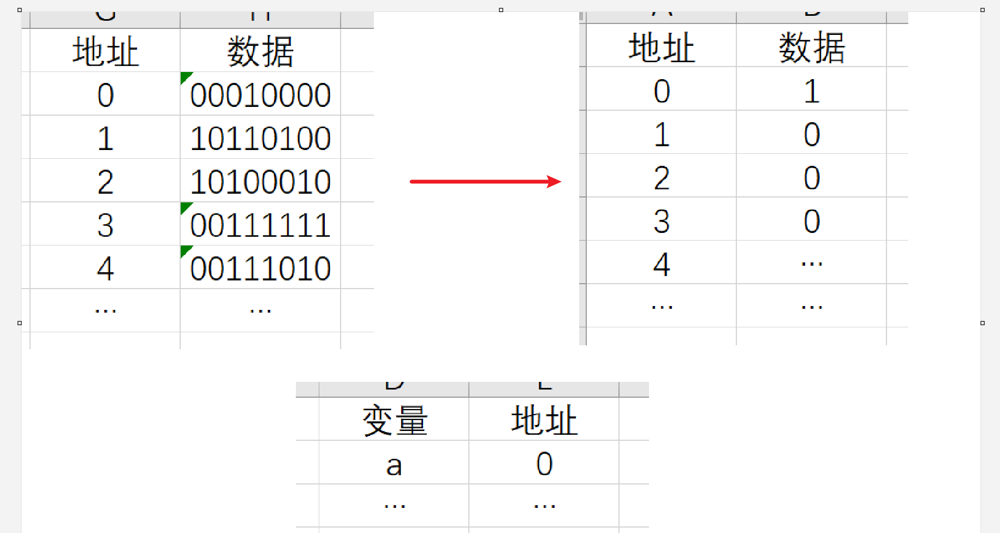

还记得这个不？

上周讲基本类型的时候，我们说 `a = 1;`是把1放在a的地址**指向**的内存空间里。如图所示。

上周还说过，我们的地址就是一个数。就像数组有个下标一样。

那......我们能不能......把一个地址放进内存空间里？就像放一个int一样？

-----

# 引用类型
如果你们听会了这个，选C++的时候听到指针就会想“就这？”了

我们假定地址也是32字节（一个int大小）的。然后我们开始画图：

我有一个值`x`，在地址114514。我有一个引用类型变量`a`。在地址0。引用类型变量a里面装着x。

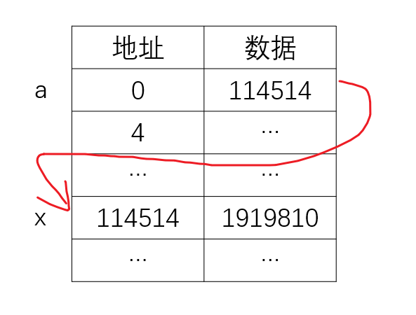
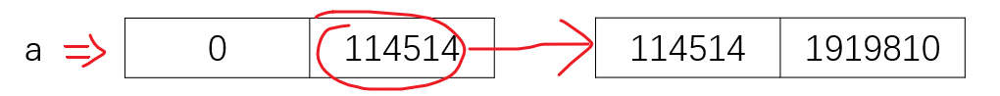

可以发现，基本类型变量直接代表一段内存，引用类型变量先代表一个地址，通过这个地址再代表一段内存。

后文我会用“指向”代表引用类型变量存的地址，“值”代表真实数据x。

（题外话：这就是32位系统为什么最大只支持4G内存，因为$2^{32} = 4 \times 1024^{3}$）

-----
# 引用类型
如果你们听会了这个，选C++的时候听到指针就会想“就这？”了


类比一下，把变量看成箱子。
- 基本类型变量这种箱子里直接装着一个物品（**值**）。
- 引用类型变量里装着一张纸条，上书“东西在编号某某某的箱子里”（**地址**）。物品得再去那个箱子里找一次。

注意：编号某某某的箱子不是变量。

-----
# 引用类型赋值
其实和基本类型赋值做一样的事

假设a是`int`类型，在地址0，这是基本类型的赋值 `a = 114514` ：
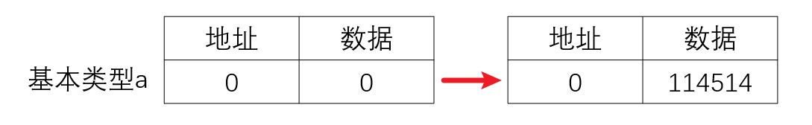

假设a是某种引用类型，在地址0；b也是某种引用类型，在地址1，指向（代表）地址114514

这是引用类型的赋值 `a = b` ：
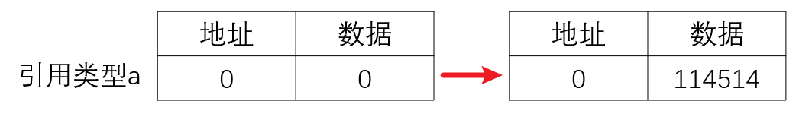

有的人就要问了：这不一模一样吗？

还真是！

-----
# 引用类型赋值
本节课最重要的一张图

我们把图的后半边画出来：
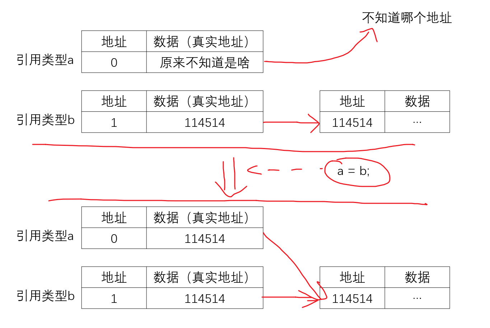

-----
# 引用类型赋值
这一张留给课后复习的同学，基本就是我上课对着上一页的图讲课的概括

赋值的过程就是把引用类型变量b里存的地址原封不动复制给引用类型变量a。

这时，a、b两个变量代表

## 同一个东西

因为两变量里存的地址相同，指向同一个内存空间。

就像箱子a、b里都有一张纸条“请去编号114514箱子找物品”，找到的肯定是同一个物品

-----
# 引用类型赋值
这一张留给课后复习的同学，基本就是我上课对着上一页的图讲课的概括

然后，对a、b两变量**值**的修改，比如：
``` java
int[] a = {1, 1, 4}, b = {5, 1, 4};
a = b;
a[0] = 10;
sout(b[0]); // 10
```

也修改的是

## 同一个东西

`a = b` 之后，a、b同时指向数组`{5, 1, 4}`。那无论是通过a这个引用，还是通过b，都在修改数组`{5, 1, 4}`。

-----
# 怎么创建引用变量的值
没有对象咋办？new一个

现在我们可以解释 `new` 关键字了：
``` java
int[] arr = new int[10];
```

这个语句由两部分构成：

`new int[10]`：java找一个内存空间，里面放上一个长度为10的int数组。这段内存空间的地址为p：
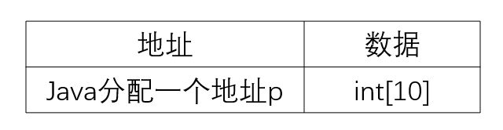

`int[] arr =`：把p赋值给引用类型变量 `arr` ，让arr指向p。
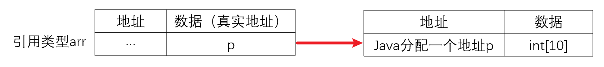

为什么基本类型不用new？因为基本类型不需要这一步，只有这张图（↑）前面的一个框（赋值），没有箭头。

-----
# 拷贝，或者clone，反正和等号不一样
有时候不能只写等号

``` java
int[] a = {1, 1, 4}, b = {5, 1, 4};
a = b;
a[0] = 10;
sout(b[0]); // 10, 但是这里我想让a和b是两个{5, 1, 4}，这里应该输出5
```

刚才提到a、b在赋值后指向同一个数组`{5, 1, 4}`。

那如果我想把b指向的数组复制一遍，让a指向复制出来的新数组（这样修改a就不会影响b），怎么操作？

``` java
a = b.clone();
```

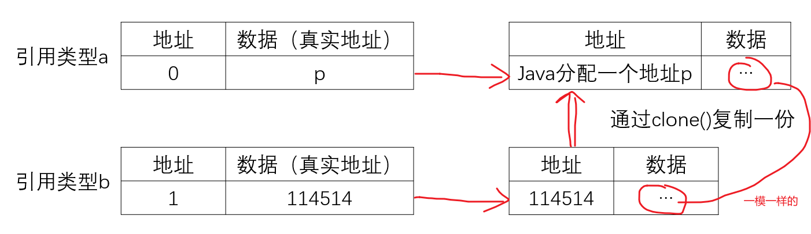

-----
# 来点经典例子（1）
典中典，<span style="color:red">期末必考</span>

``` java 
public static void notRef(int a) {
  a = 1;
  sout(a); // 1
}

public static void ref(int[] arr) {
  arr[0] = 1;
  sout(arr[0]); // 1
}

public static void main(String[] args) {
  int x = 0;
  int[] xArr = {0, 1, 2};
  notRef(x);
  notRef(xArr);
  sout(x); // 0
  sout(xArr[0]); // 1
}

```

可以把函数传参理解为一个普通的赋值`a = x`，`arr = xArr`。

-----
# 来点经典例子（1）
典中典，<span style="color:red">期末必考</span>

<div grid="~ cols-2">
<div>
基本类型的赋值：
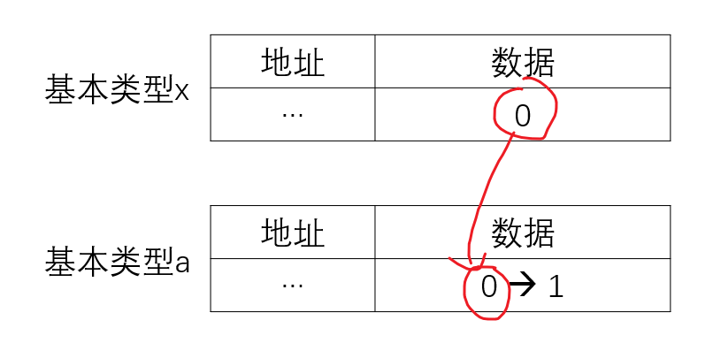

x的数据被赋值给了a。

注意，这是在两个不同地址下做的修改。

修改下面那个框里的数据肯定不影响上面那个。

所以函数外的`x`没有被修改。
</div>
<div>
引用类型的赋值：
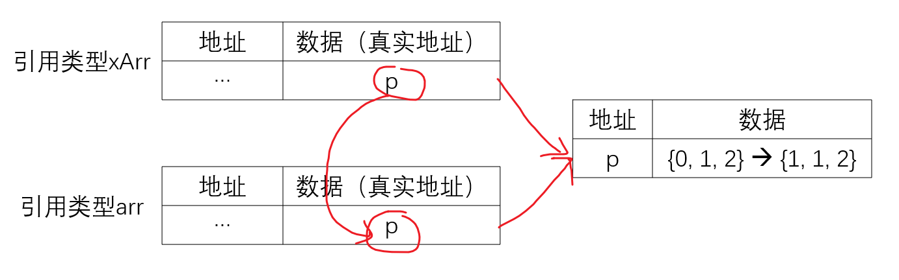

xArr的数据被赋值给了arr。\
由于这俩是引用类型，里面存的数据是地址。\
现在它们指向同一个数组。

虽然xArr和arr的地址也不一样...\
但我们做修改是在地址p做。

所以arr改了，函数外的xArr也被改了。
</div>
</div>

-----
# 来点经典例子（1）
一点补充，负责把你们的脑子搞糊涂

老师上课应该会讲到“java的函数是传值（pass by value）的”。

这句话里的“值”是指数据（真实地址），不是我课件里的值（真实数据）。

<span style="color:red">以下不要往脑子里去，和考试说法不一样！！！！！！！！！！！也不需要会！！！！！！！</span>

事实上传值和传引用这个概念有点老掉牙了。stackoverflow上的一个高赞回答是“pass by object handle”

java这套语法是缺少一种操作的：


我不能用一个新的对象**覆盖**地址p里的数据，只能用该引用类型支持的方法**修改**地址p里的数据。

如果是引用，应该支持这种操作。如果是值，应该没有红色箭头。所以这个说法老了一点。

我不知道lecture会不会提到垃圾回收，提到了再从这里补充。

-----
# 来点经典例子（2）
典中典，<span style="color:red">期末不一定考</span>，但是和上一个完全一样

``` java
int[] arr = {1, 2, 3};
for (int v : arr) {
  v = 1;
}
// arr: {1, 2, 3}
```

foreach循环拆出来是：
``` java
for (int i = 0; i < arr.length; i++) {
  int v = arr[i];
  v = 1;
}
```

完全等于基本类型传参。arr数组就是一堆基本类型（`arr[i]`是`int`，基本类型），所以arr不会改。

下一个就不太一样了...

-----
# 来点经典例子（3）
典中典，<span style="color:red">期末很可能考</span>，但是和函数传参基本一样

来个二维数组：
``` java
int[][] arr = {{1, 2}, {3, 4}}; // 好像没这个语法，意思到了就行
for (int[] v : arr) {
  v[0] = 5;
}
// arr: {{5, 2}, {5, 4}}
```

foreach循环拆出来是：
``` java
for (int i = 0; i < arr.length; i++) {
  int[] v = arr[i];
  v[0] = 5;
}
```

完全等于引用类型传参。arr数组就是一堆引用类型（`arr[i]`是`int[]`，引用类型），所以arr会改。

-----
# n维数组
引用的引用的引用的引用的引用的引用的引用的引用的引用的引用的引用的引用的引用的引用的引用的引用的......

``` java
int[][][][][] arr;
```

这东西在内存里长这样：
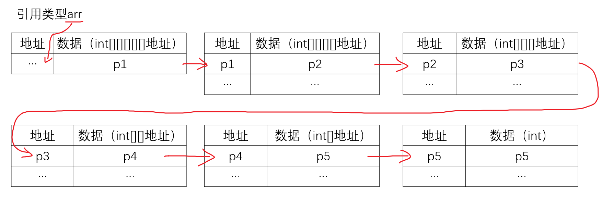

n维数组本质上是“数组的数组”。int数组是一堆int，`int[][]`就是一堆`int[]`，不是个矩阵一类的东西。

-----
# null
什么也没有（字面意）

``` java
int[] a = null;
```
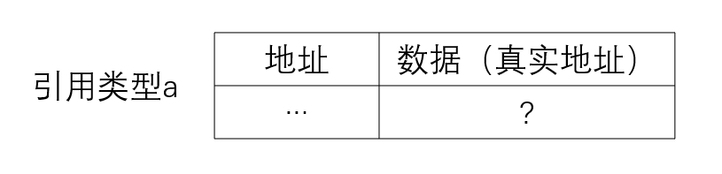

引用类型里存的地址是要指向什么东西的。但它也可以不指向....

我们用null来代表这个引用类型里什么也没有。用箱子那个比喻的话，箱子里的纸条是“该物品不存在”。

``` java
sout(a[0]);
a[0] = 1;
```

假设这一类箱子里装的东西可以涂色。这时候有人问：物品是什么颜色？或者发出指令“把物品涂成红的”。

java表示，物品都没有我怎么知道什么颜色？？？？？？？然后`NullPointerException`。

-----
# 方法
听说你们这节课学了oop，希望人没事。方法在oop里是很重要的一环，但这是下节课的事了。

首先，我会在各种场合把方法(method)叫成函数(function)。这两个完全等价，一个意思。

``` java
public static int func(int arg) {
  ...
  return ...;
}
```

- `public static`：下节课，下节课
- `int`：返回类型
- `func`：函数名
- `int arg, ...`：参数

看看就好，大课讲过。

注意，`return`语句对基本类型和引用类型的处理和传参一样。

-----
# 为什么要有方法
oop里有大用，但是现在...

- 偷懒。换个更好听的说法，代码复用。
- 让代码更清楚。（用方法名来做注释，分离不同功能）
- 不需要重复改动。如果一段逻辑重复出现，需要修改时在方法里只需要改一次，复制粘贴的代码需要改多次还容易漏。

-----
# 为什么要有方法

<div grid="~ cols-2">
<div>
比如上周那个题：
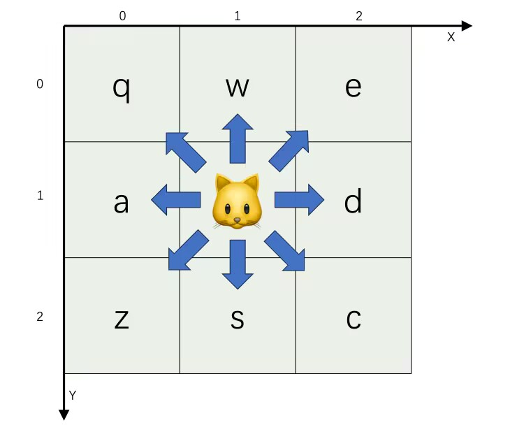

当时还没学方法，大伙会在每个分支里写一个判断。

问题：若干天后看到`x - 1 > 0 && y - 1 > 0`，不知道什么意思。在八个地方分别处理，逻辑容易出错。

统一提取一个方法，条件和命名都很清楚。

而且这里看到方法名就知道它能做什么， \
**不需要关注具体逻辑**，减轻大脑负担
</div>
<div>

``` java
switch(s.charAt(0)) { // bad
  case 'q':
    if (x - 1 >= 0 && y - 1 >= 0) { // wtf is this
      x--; y--;
    }
  case 'w':
    if (y - 1 >= 0) {
      ...
    }
  ...
}

boolean checkBound(int x, int y) {
  return x >= 0 && x < n && y >= 0 && y < n;
}

for () {
  switch(s.charAt(0)) { // better
    case 'q':
      if (checkBound(x - 1, y - 1)) { // 很清楚！
        x--; y--;
      }
    ...
  }
}

```
</div>
</div>

-----
# 为什么要有方法

<div grid="~ cols-2">
<div>
这里还可以偷懒：为什么我写了`x - 1`还要写`x--`啊，好麻烦！

那再提取一个方法，输入字符，输出这一字符应该走到的坐标。

这里要返回两个数，那返回值就用int数组好了。

现在不用写两遍`x - 1`了，并且...

原来的边界检查和更新坐标都在那个switch里面，重复了8次。这些重复也都没有了。

而且逻辑比原来清晰了很多。\
获取坐标->检查边界->更新坐标，一步一步非常清楚。

原来的写法是**嵌套**的。一个功能里面**包含**另一个，不能一眼看完全部的逻辑。需要避免。
</div>
<div>

``` java
boolean checkBound(int x, int y) {
  return x >= 0 && x < n && y >= 0 && y < n;
}

int[] getNewPosByChar(char command, int x, int y) {
  switch(command) {
    case 'q':
      return new int[]{x - 1, y - 1};
    ...
  }
}

for() { // best
  int[] newPos = getNewPosByChar(s.charAt(0), x, y);
  if (checkBound(newPos[0], newPos[1])) {
    x = newPos[0];
    y = newPos[1];
  }
}
```
</div>
</div>

-----
# 为什么要有方法
<div>
如果题目要求变了，变成边界不能超过`n / 2`：

现在的写法只需要定位`checkBound`方法，把n改成n / 2，结束。

原来的写法需要定位所有n，把他们全都改成n / 2（需要改四个）。容易漏。

这里只有四个，按ctrl+左键点一下变量n就能全找到了，还好。

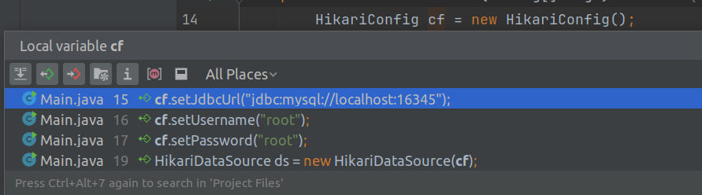

我实习的时候在公司见到一个变量几百个引用的屎山。。。哭都没地方哭。
</div>

-----
# 如何给方法写注释
code comment itself，但很多时候不够。

在方法的上一行输入 `/**`然后回车，idea会生成这么个东西：

<div grid="~ cols-2">
<div>
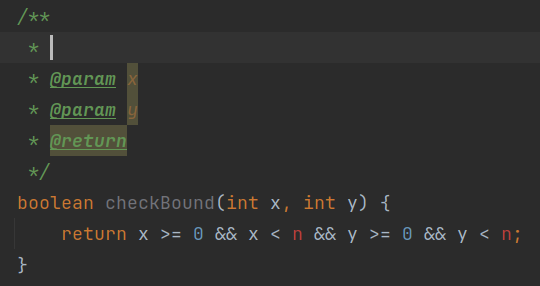
</div>
<div>
<br />
&lt;----讲课的时候这个图会放大
</div>
</div>
这个叫javadoc。不考。只是给大伙看一眼标准是啥样。

个人建议注释包含下面几条：

- 如果你感觉你的参数名不足以表达你的意思，在`@param`后面写参数的用途。
- 如果你感觉你的函数名不足以表达返回值的意思，在`@return`后面写返回值是什么
- 如果你感觉你通过函数名一眼看不出函数是在干什么，在最上面描述你的函数
- 如果你的函数参数是引用类型并且你在里面改了参数值，一定要在`@param`或者最上面表明改了什么怎么改的
- 如果你的函数改了全局变量，一定要在在最上面表明改了什么怎么改的

-----
# 如何给方法写注释
code comment itself，但很多时候不够。

如果你按照这个格式写注释，你把鼠标放在这个方法上的时候，idea会帮你显示：

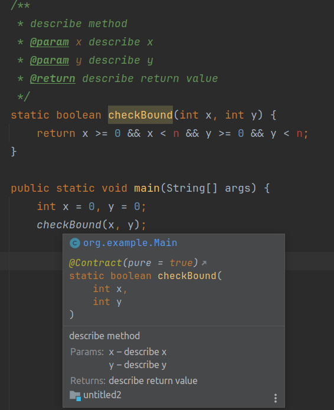

非常好用！
