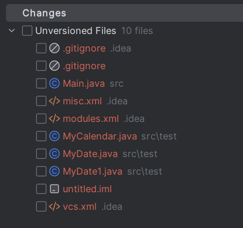
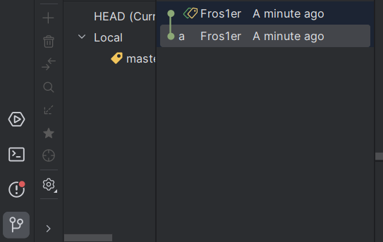
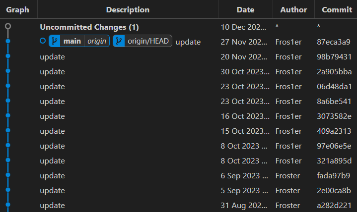
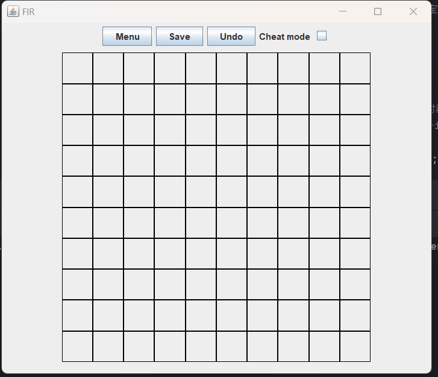

# Java互助课堂（周五
# 6.5. jvav swing，也就是GUI

徐延楷 a.k.a. Froster  
20级的老东西

这个是简单的

-----
# 关于project
<div />

- 大概率不查重
- 答辩的时候，老师或者sa对着要求让你演示一遍功能，你自己再讲你的bonus有哪些
    + 几乎不看代码
    + 大部分是你自己操作，所以有bug的地方你可以操作一下来回避
- 早开始，要不然会和期末冲突
- 不要相信你的队友
    + 你的队友可能是不在乎分数的摆子，也有可能是把java project丢给你自己去复习高数大物的烂人
    + 也有可能是不沟通的摆子，这种最烦人，基本套路是前面一段时间说在做，最后一天告诉你不会做，你一看，他啥都没干
    + 多少push一下你的队友，检查他的进度
    + 如果push不动...做好自己做完的打算。保留好记录，是hxd就让ta狠狠请你吃饭，你讨厌的话就贡献比28开
        - 不要尝试10 0开，会和稀泥
- 一个人是能做完的

-----
# git
必学

git，一个版本控制工具。既然你们都是寄系的那必须会。他可以干这几件事：
- 回滚代码（你的代码之前能跑，改过以后不能了。你需要退回以前的版本
- **合并代码**（你的队友写了一部分，你写了一部分，很难合起来
- ~~能直观的看到工作量，还有某段代码是谁写的，方便分锅~~

关于怎么在idea里用git，还有怎么注册github，我就不细讲了（懒得截图

主要讲一下概念以及该去网上查什么

-----
# git add & commit
<div />

git有回滚代码的功能，要回滚肯定是回滚到某一个时间点

我们把这些时间点叫做commit，可以理解为一个快照。每个快照包含项目文件夹下所有**被追踪**的文件的备份。



要让git追踪一个文件，在这里打上勾（git add），然后点截图没有截到的commit。


注意，你修改的代码在实际commit之前不会记录在git里面！  
如果你有修改但未提交的代码，执行git命令时可能会丢失。

-----
# git回滚
<div />

要回滚到之前的一个commit：


点击左下角那个按钮，这里是所有的commit。点击你想回到的那个commit，选择“checkout revision xxx”。

如果要回到最新，点击最上面的commit，选择“checkout revision master”

千万不要碰git revert那个选项，除非你知道你在干什么。git revert --HARD会让你丢掉某一个commit后的所有提交！

-----
# git commit message
<div />

有时候你会发现，回滚到上一个版本也没有解决问题，问题有可能是你队友几个commit前引入的...

为了更快的确定问题，最好能知道每一个commit都改了什么。你可以直接点到commit看修改过的代码，也可以写好commit message。



这是我课件的一些commit。里面的update就是commit message。这不好。正确的写法是写清楚改了什么部分。  
e.g. "fix game board"

-----
# git remote
<div />

接下来是...github。git是一个工具，github是基于git这个工具的一款协作平台。

如何把你的项目放在github上我就不讲了。总之，绑定完以后：
- git push用于把你本地的commit提交到github上，让你的队友能看到
- git pull用于把github上的commit拉取到本地，让你拿到你队友的代码。

这里就会出现了一个问题：假设你和你队友同时改了一个文件，同时commit并提交了，咋办？

遇到这种情况idea会弹一个三列窗口，两边是你和你队友的代码，中间是最终结果。你需要把这两个版本的文件合起来。

合起来这一步也会作为一个commit，别忘了提交。

-----
# project整体的工作流程
<div />

- 分工。印象里分工一般是一个前端一个后端。不过你们也可以按照功能分工，每个人写project的几个点。
- 搭一个框架出来。可以用给的demo，也可以自己搓。课后我会给你们做demo的代码鉴赏。
- 写功能。这部分最好能几个人互不影响的干活...
    + 比如，一个人写各种菜单，另一个人写游戏。在写菜单的时候先把游戏页面留出来，让另一个人写。
    + 一个人写游戏逻辑，另一个人在写ai。写游戏逻辑的先设计好ai该如何调用游戏相关的函数。
    + 在合并代码的时候，多沟通！！！！！！
- 有前瞻性的写完基础功能。漂亮的ui，人机对战，用户数据等等的bonus都放到后面。
    + 在基础功能里面，最先要有的肯定是你们的游戏主界面。这样你们才能俩人一起开工。
    + 但是，如果确定要做bonus，确定你最后能把他加进去！
    + 比如，先把ui的panel留好，人机对战先写一个全随机的ai，等等。
- 写点bonus。

-----


# 回调函数(callback)
在写gui之前得先升级一下大脑

你们之前写的代码是这样的，从main函数开始执行，一路执行到main函数结尾：

``` java
psvm() {
    // ...
    // call method
    // input
    // calculate...
    // return
}
```

java swing用的不是这个模式。代码的执行并不从上到下：
``` java
void confirm_button_callback(ActionEvent e) {
    // do something
}
void another_button_callback(ActionEvent e) {
    // do something else
}
btn.addActionListener(e -> confirm_button_callback(e));
```0

-----

# 回调函数(callback)
在写gui之前得先升级一下大脑

``` java
static int a = 1;
void confirm_button_callback(ActionEvent e) {
    sout(a);
}
psvm() {
    a = 2;
    btn.addActionListener(e -> confirm_button_callback(e));
}
```

在addActionListener这一行，confirm_button_callback并不实际执行。 

它把confirm_button_callback绑定给按钮btn，当按钮被按下去的时候，这个函数才实际被执行

so，a的值不太可能是2，因为很有可能程序的其他部分改过a（

-----

# 事件驱动
继续大脑升级

一个java swing程序的工作流程大体是这样的：

1. 你在主菜单点击了开始游戏按钮。按钮按下后调用一个init方法，初始化你的游戏所需的各种变量。
2. 整个游戏是由一堆按钮组成的。每个按钮调用一个方法以某种方式改变这些变量
    + 但这些按钮可不一定哪个先被按...得想好你的逻辑
3. 在变量被改变后（类似于下了一步棋之后），检查这些变量是否满足某些条件，比如游戏结束
4. 根据这些条件来决定下一步干什么，是继续等待按钮，还是宣布游戏结束，还是解禁几个其他按钮，etc.
5. 结束以后退出游戏，返回主菜单，再点击开始游戏。这时候就考验你的初始化是不是到位了。
    + 如果有些变量保持了上一局的状态，会很头秃（

时刻注意代码不是以一个确定顺序从上往下执行的。不同的方法（代码块）会根据你的按钮(事件)不按顺序的执行。

-----
# 联网和AI对战
别问为啥这么快

既然按钮输入是一个随意发生的事件...那AI和联机也是。

把AI和联机嵌入游戏的方法大致如下：

``` java
btn.addActionListener(e -> move(p1, p2););
// ...
void move(p1, p2) {
    // move your pieces
    // check conditions
    nextplayer();
    if (player instanceof AIPlayer ai) {
        ai.nextStep();
    }
}
void nextStep() {
    // calculate
    move(p1, p2);
}
network.addSomethingListener(args -> move(args.p1, args.p2))
```

比如说，棋子移动是一个事件，这个事件可以通过不同的方式触发，但是触发后的效果是一样的。

-----
# java swing
凭记忆讲吧

swing其实是一个...并不复杂的东西，简单讲讲。

每个应用程序都有一个窗口，这个是`JFrame`，你可以通过它控制窗口大小，标题，乱七八糟的和窗口有关的。
- JFrame里自带一个JPanel，用getContentPane()来获取。

应用程序里需要显示文字，这个是`JLabel`，可以控制显示什么文字，用什么字号，什么颜色，显不显示，等等。

应用程序里需要按钮，`JButton`，也可以控制大小文字颜色啥的，可以给它绑定一个方法，在被点击的时候调用

除了按钮还有其他的输入方式，比如文本框复选框一类的，查一下找个例子就ok，会有一个方法获取里面的值，也会有一个Listener来在值改变的时候通知你

需要一个方式来给文字和按钮排版（放哪里），于是有了`JPanel`和各种Layout

需要以各种方式接受用户输入，所以有各种Listener

-----
# JPanel和Layout
<div />

JPanel（以及Box和其他一些）是一个容器。里面可以装其他的一些组件，以及嵌套的装JPanel。

三种用法：
- 统一管理组件。比如说让一些组件一起隐藏掉
- 加背景图/背景色，也可以客串一下用来显示图片
- 给里面的东西**布局**

常用的布局：GridLayout和BorderLayout，还有默认

GridLayout把整个Panel分成n*n个格子，每个格子里可以装东西

BorderLayout把Panel分成东西南北中五个部分，每个部分可以装东西

这两个一般是装一个JPanel，Panel里面再装其他组件

默认是从上到下从左到右

-----
# JPanel和Layout
<div />

一个例子：



这个界面最外面是一个大的JPanel，使用BorderLayout

菜单栏是一个默认Layout的JPanel，里面装一些按钮，添加到BorderLayout的北边（上面

中间是一个类似于GridLayout的JPanel，里面装棋子，添加到BorderLayout的中央

中间的Panel的每个格子里面是一个JPanel（用来居中），JPanel里面是JLabel

-----
# JPanel和Layout
<div />

上一页的代码：
``` java
JPanel bg = new JPanel(new BorderLayout())；
JPanel menuBar = new JPanel();
menuBar.add(menuButton);
menuBar.add(saveButton);
menuBar.add(undoButton);
bg.add("North", menuBar);
BoardView board = new BoardView(); // 这个是我自己的库里面的，可抄
this.add(board); // 添加到中央
```

总体流程：
- 创建好各种组件，设置好布局
- 把他们按照关系都add进去

很无聊的工作。

-----
# 万恶的重写
<div />

网上有很多代码，里面包含：
``` java
public class MyPanel extends JPanel {
    // ...
    @Override
    protected void paintComponent(Graphics g) {
    }
    // ...
}
```

我的建议是，别用。
我两年前写了一个完整的swing 2D格子游戏框架，用到这个的也就显示背景图，和保持GridLayout的格子为正方形。
- 这俩看https://blog.froster.icu/SUSTechCS109ProjectGuide ，在最下面。

其他的需求都可以用布局管理器解决，除非你想做动画。

如果你碰到一个需求不会解决，先问stackoverflow，没找到再问我。

-----
# Listener
<div />

应用程序需要获取用户输入，于是有了各种各样的Listener。

Listener的本质：某件事发生时，调用绑定的方法。就是刚才讲的回调。你们一般只会用到两个：

- ActionListener  
    这个比较多种多样。包括按钮点击，复选框选中/解除，滑动条值改变，等等。可以去网上查查例子。
- MouseAdapter  
    鼠标点击事件，一般用来让没有ActionListener的组件（比如上一页的格子是个JPanel）能被点。

``` java
gridViewComponent.addMouseListener(new MouseAdapter() {
    private boolean pressed = false;
    @Override
    public void mousePressed(MouseEvent e) {
        super.mousePressed(e);
        pressed = true;
    }
    @Override
    public void mouseReleased(MouseEvent e) {
        super.mouseReleased(e);
        // do sth
        pressed = false;
    }
});
```

-----
# 杂项
好用的东西

做游戏菜单用CardLayout，可以方便的在几个不同的JPanel里切换

弹窗用JDialog，有一个可以在里面塞JPanel的JDialog，好用

JFileChooser用来选择文件，百度一下就知道是啥了

要打乱一个一维数组，用Collections.shuffle()

音效，调我的库

图片，背景图调我的库，小图用JLabel.setIcon

可执行文件打包，exe4j。或者打成一个jar文件，然后写个.bat或者.exe用命令行执行jar。

动画，组件不能穿越不同Panel
- 除非你忘记我这节课的所有内容，不用GridLayout，重写JPanel的绘制细节。如果你是大佬，请随意！
- 如果你把棋子图标设置成gif，在不同情况下切换不同gif，这也是一种动画！

-----
# 怎么把数据和界面同步？
<div />

``` java
public class Piece {
    PieceType type;
    Color color;
}

Piece[][] board;
JLabel[][] displayedBoard;
```

你的程序里很可能有一个只存数据的board，和一个java swing的只用来显示的棋盘。

如何在改board的时候把显示内容一块改掉？

-----
# 怎么把数据和界面同步？
<div />

方法1：把这俩东西都public static了

``` java
public static Piece[][] board;
public static JLabel[][] displayedBoard;
public static movePiece(p1, p2) {
    board[p2] = board[p1];
    displayedBoard[p2].xxx();
}
```

大力出奇迹，肯定能用，但是不咋优雅，不是很java

容易写成屎山，还很难小组分工，因为俩人负责的代码纠缠在一起

-----
# 怎么把数据和界面同步？
<div />

方法2：把这俩东西合并了

``` java
public class Piece extends JLabel {
    PieceType type;
    Color color;
}
public static Piece[][] board;
public static JPanel grids;
public static movePiece(p1, p2) {
    board[p2] = board[p1];
    grids.remove(board[p2]);
    grids.add(p2, board[p2]);
}
```

这是反面教材，比上一种更容易写成屎山，更难分工

并且这种写法没法序列化，不要用

-----
# 怎么把数据和界面同步？
<div />

方法3：事件系统，又名Observer或者publish/subscriber

我们写一个类似于java swing listener的东西，在移动棋子的时候通知swing：

``` java
public static Piece[][] board;

public static movePiece(p1, p2) {
    board[p2] = board[p1];
    EventCenter.notify("PieceMove", new PieceMoveEvent(p1, p2));
}

private JLabel[][] displayedBoard;
EventCenter.subscribe("PieceMove", e -> {
    displayedBoard.show(); //...
})
```

EventCenter可以自己写，也可以用我的库（广告x114514

这个是推荐的，这么写不会让前后端的代码混在一个文件里，方便合作。

此外，由于事件是广播的，可以给它绑定多个方法，如果你想添加步数统计，可以在这里绑定新方法而不影响现有的任何功能。非常优雅。

-----
# lambda表达式 / 函数式接口
这俩是一个东西

你们应该看到过
``` java
btn.addActionListener(e -> {
    // do something
});
```
这个东西是
``` java
btn.addActionListener(new ActionListener() {
    @Override
    public void actionPerformed(ActionEvent e) {
        // do something
    }
});
```

的简写。ActionListener是**只有一个方法**的接口。被称作函数式接口（因为只有一个方法，就像个方法一样）

这种写法的理念是“把方法存在变量里，调用时从这个变量拿出方法来执行”。这样就可以在运行时决定执行哪个方法了。

-----
# lambda表达式的捕获
``` java
Object o;
btn.addActionListener(e -> {
    sout(o);
});
btn.addActionListener(new ActionListener() {
    @Override
    public void actionPerformed(ActionEvent e) {
        sout(o);
    }
});
```
这个o不是public static的，为啥能直接写在里面呢？

答案是这也是一个简写，我们管这个叫捕获：
``` java
class MyActionListener implements ActionListener { Object o; }
btn.addActionListener(new MyActionListener(o) {
    @Override
    public void actionPerformed(ActionEvent e) {
        sout(o);
    }
});
```

-----
# public static
<div />
全局变量就不说了，游戏棋盘啥的

还有一个叫工具类的东西，就像`java.Math`，不需要实例化，里面装一些有用的方法：
``` java
public class Saver {
    public static void save(String path) {
        // get board and do something to save
    }

    public static void load(String path) {
        
    }

    // everything related to save game

    private Saver() {} // 防止这个类被实例化。
}
```
