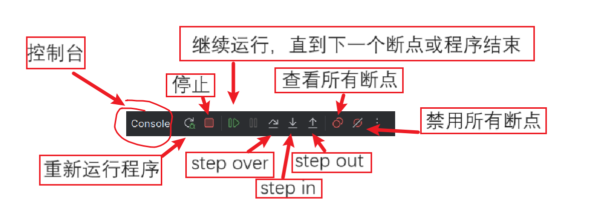
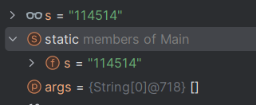

# Java互助课堂（周一
# 如何debug

徐延楷 a.k.a. Froster  
20级的老东西

第二次课讲不完就讲这个

周一和周五的风格大概也许差别挺大

-----

# 扫左边的签到，右边的加互助课堂群
（来这的不会有人没加互助课堂群吧orz

<span style="color: red">七</span><span style="color: lime">点</span><span style="color: blue">开</span><span style="color: green">讲</span> \
社恐犯了 整点花活

## wtf 这么多人 这都比某门寄系必修专业课人多了
<br />

<div grid="~ cols-2 gap-4">
<div>

</div>
<div>

</div>
</div>
---

# debug？
为啥叫这名？

除错。除(de)错(bug)。

在计算机刚发明的年代，没有集成电路（芯片/电路板）。

当时的电脑和配电箱差不多，成千上万的电缆连着成千上万巨大的元器件。

上世纪40年代的某天，有只蛾子钻到了哈佛大学某台电脑的元件里，元件短路了，造成了运算错误。

bug原本就指代机械设计里的小缺陷，这么一搞...就进入了计算机领域。


-----
# oj常见错误
从第一节课的ppt里复制粘贴真爽

- Wrong Answer：你程序输出错了
- Compile Error(CE)：编译错误。检查：主类应该是Main，开头应该没有Package，程序没有语法错误
- Runtime Error(RE): 程序报错了。一般来说是数组越界，或者你有个数除以0了。
- Timeout(TLE)：程序超时了。java作业不考察程序的高效性，所以一般是你的程序里有死循环。

debug前先确定错误类型。

btw，错误类型还挺多，过会可以教你们点花活...

-----
# 我们写oj题debug的时候要干什么
坐牢（真的坐牢

五步：
- 确定一下错误的类型（检查报错，检查格式，重新读题）
- 读一遍你的代码，排除粗心错并确保代码和你的逻辑一致
- 造数据（样例是不够的）
- 跑程序（获取结果，和手算的做对比）
- 如果需要的话，获取中间结果

-----
# 错误类型
至少别当无头苍蝇瞎蒙...

- 程序报错了（CE/RE/TLE）
    + 哪里手残了（点名批评大括号错位 / 加打成减 / 打错变量名 / ....）
    + 如果是数组越界/空指针，逻辑有问题/没check边界条件
- WA了
    + 理解错题了，重写吧（悲
    + 输出格式错了（多了个空格空行不算在内，oj还是有这点智能的）
    + 溢出了，用long
    + **逻辑有问题**

-----
# 怎么造数据和使用造出来的数据
随机！

对于字符，没什么好的办法。手动吧。

对于一系列数字（以及wasd这种可以用数字表示的），可以造随机数。

``` java
import java.util.random;

// ...

Random random = new Random();
random.nextInt(); // 随机生成一个int
random.nextInt(0, 10); // 随机生成一个范围在[0, 10)的int
random.nextDouble(); // 也有下面的形式
random.nextBoolean();
```

用起来很像scanner。按照输入数据的格式造出来打印就行。

获取正确输出...你需要一个已经AC的好同志。把你造出来的一堆样例给他，让他帮忙跑跑就有了正确输出。

不准共享代码又不是不准共享样例。

-----
# 为什么我的程序这么跑？
它没有自己的想法

在我们发现程序报错，或者和预期结果不一致之后，只靠读代码是很难看出错误原因的。

这时候，我们需要知道程序的运行过程，比如这个if进了什么分支，那几个变量在某些时候是什么值。

这样做可以方便快捷的定位问题。

介绍两种半方法：
- 打印
- debug
- ~~hack oj~~

-----

# 打印
非常的trivial

``` java
int x, y;
for (int i = 0; i < n; i++) {
    // ...
    printf("x: %d, y: %d\n", x, y);
    arr[x][y] = 114514; // IndexOutOfBounds occurred here
    // ...
}
```

很常见的一种做法。在可能出问题的地方把变量打一下，看看中间步骤是不是符合预期。

优点是可以一次性打很多东西出来方便一步一步分析，或者一次分析不同结果

缺点...麻烦，而且如果往oj上交的时候忘记删了，寄

-----

# debug
为啥我当时上java的时候没人教呢

首先，假定你们都在用idea，并且都是新版UI

把鼠标移到旁边行号上，会有一个红色圆点。


这个东西叫“断点”。如果某一行被打了断点，在debug模式下，java会在这一行之前暂停运行（不执行这一行

点一下这个位置，把断点打下来。


运行程序的时候点三角形旁边那个debug按钮，启用断点
 

-----

# debug
为啥我当时上java的时候没人教呢

程序会在这一行停下来。

 

这时候注意下面的watch窗口（如果不小心关了，点一下左边箭头指着的按钮）：

 

-----

# debug
为啥我当时上java的时候没人教呢

分别介绍一下窗口里的功能。首先是控制台：
 

- step over：执行本行，在下一行暂停（不进入函数）
- step into：如果这一行有函数，在这个函数第一行暂停。如果有多个函数，会标黄让你选择具体进入哪一个。
- step out：执行完当前的函数。在当前函数所在的一行暂停。

-----

# debug
为啥我当时上java的时候没人教呢

有点抽象。举个例子：
<div grid="~ cols-2 gap-4">
<div>

``` java
public int f1() {
    int x;
    x = 1; // breakpoint 2
    return x; 
}
public void func() {
    println(f1()); // breakpoint 1
    f2();
}
```

为什么停在x=1这一行：变量声明不执行任何东西，函数声明也一样

在这里打断点没有作用：
 

</div>
<div>

在断点1（进入断点时本行啥也没执行）：
- step over：执行完f1和println，停在f2这一行
- step into：会让你选择进入println还是f1。\
选择f1后停在`x = 1`这一行
- step out: 完整执行完func后暂停

在断点2：
- step into：没有函数，和step over一样
- step out: 完整执行完f1，在`println(f1());`这一行暂停。 \
现在程序处在执行完f1没执行println的状态
</div>
</div>

-----

# debug
为啥我当时上java的时候没人教呢

这是调用栈（call stack）（名字了解即可

 

这里执行的是上一页的例子。我们看到main调用了func，func调用了f1。

双击f1会让编辑器跳转到f1里目前停着的那一行，双击func会让编辑器跳转到func调用f1的那一行。

-----

# debug
为啥我当时上java的时候没人教呢

这是watch窗口，里面有所有当前函数里的变量。

 

有的人就要问了：如果我现在想看main里的变量咋办？

双击左边调用栈的main。

 

-----

# debug
为啥我当时上java的时候没人教呢

 

注意arr前面有个小箭头。点击可以展开。

对于所有的非基本类型都可以展开。

-----

# debug
为啥我当时上java的时候没人教呢

如果有一个全局变量要看，可以右键它，然后点击
 

或者去static里找。
 

还有一个强大的evaluate expression功能，在框里输入表达式就可以实时的显示返回值
 

-----

# debug
为啥我当时上java的时候没人教呢

刚才有个查看所有断点功能。点一下，左上角有个加号，操作一下：

 

然后你的程序就会在所有的数组越界停下来。

-----

# hack oj
你们别说是我教的

有时候吧，lab太坐牢了。你造了114514个样例还是WA，其他人也没好建议，你想一拳打爆这个oj。

有个迫不得已的办法。还记得这个东西吗：

- Timeout(TLE)：程序超时了。java作业不考察程序的高效性，所以一般是你的程序里有死循环。

如果你猜测你的程序可能在某某条件下出问题，但是不确定某某条件到底发没发生，可以这么做：

``` java
if (condition) {
    while (true) {

    }
}
```

如果进了这个分支，你会看到一个TLE。

别说是我教的！！！！！！！！！！！！！
